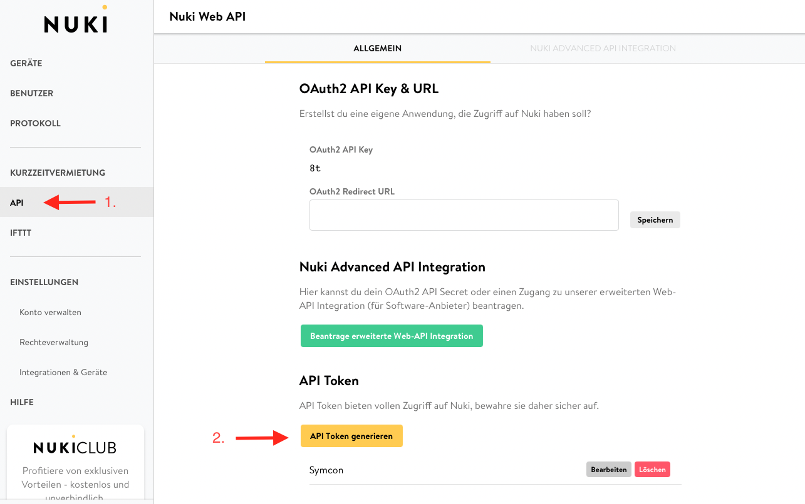

# Nuki Splitter Web API  

[](https://nuki.io/de/)

Dieses Modul stellt die Kommunikation mit der Nuki Web API her.

Für dieses Modul besteht kein Anspruch auf Fehlerfreiheit, Weiterentwicklung, sonstige Unterstützung oder Support.  
Bevor das Modul installiert wird, sollte unbedingt ein Backup von IP-Symcon durchgeführt werden.  
Der Entwickler haftet nicht für eventuell auftretende Datenverluste oder sonstige Schäden.  
Der Nutzer stimmt den o.a. Bedingungen, sowie den Lizenzbedingungen ausdrücklich zu.  

### Inhaltsverzeichnis

1. [Funktionsumfang](#1-funktionsumfang)
2. [Voraussetzungen](#2-voraussetzungen)
3. [Software-Installation](#3-software-installation)
4. [Einrichten der Instanzen in IP-Symcon](#4-einrichten-der-instanzen-in-ip-symcon)
5. [Statusvariablen und Profile](#5-statusvariablen-und-profile)
6. [WebFront](#6-webfront)
7. [PHP-Befehlsreferenz](#7-php-befehlsreferenz)

### 1. Funktionsumfang

* Kommunikation mit der Nuki Web API

### 2. Voraussetzungen

- IP-Symcon ab Version 5.5
- [Nuki Web Aktivierung](https://web.nuki.io/#/login)
- Nuki Web API Token  

  [](https://nuki.io/de/)

### 3. Software-Installation

* Bei kommerzieller Nutzung (z.B. als Einrichter oder Integrator) wenden Sie sich bitte zunächst an den Autor.
* Über das Module Control folgende URL hinzufügen `https://github.com/ubittner/SymconNukiWeb`

### 4. Einrichten der Instanzen in IP-Symcon

 Unter 'Instanz hinzufügen' kann das 'Nuki Splitter Web API'-Modul mithilfe des Schnellfilters gefunden werden.  
	- Weitere Informationen zum Hinzufügen von Instanzen in der [Dokumentation der Instanzen](https://www.symcon.de/service/dokumentation/konzepte/instanzen/#Instanz_hinzufügen)

__Konfigurationsseite__:

Name        | Beschreibung
----------- | ------------------
Aktiv       | Schaltet den Splitter in- bzw. aktiv
API Token   | API Token
Timeout     | Netzwerk Timeout

### 5. Statusvariablen und Profile

Die Statusvariablen/Kategorien werden automatisch angelegt. Das Löschen einzelner kann zu Fehlfunktionen führen.

#### Statusvariablen

Es werden keine Statusvariablen verwendet.

#### Profile

Es werden keine Profile verwendet.

### 6. WebFront

Die Splitter Instanz hat im WebFront keine Funktionalität.

### 7. PHP-Befehlsreferenz

```text
Liste der intelligenten Schlösser (Geräte) abrufen

NUKISW_GetSmartLocks(integer $InstanzID);
Liefert als Rückgabewert einen json-String mit allen vorhandenen Geräten.

Beispiel:

$devices = NUKISW_GetSmartLocks(12345);
```


```text
Aktualisiert die erweiterte Konfiguration eines Nuki Openers

NUKISW_UpdateOpenerAdvancedConfig(integer $InstanzID, string $SmartLockID, string $Config);
Liefert keinen Rückgabewert

Beispiel:

$config = '{
            "intercomId":0,
            "busModeSwitch":0,
            "shortCircuitDuration":0,
            "electricStrikeDelay":0,
            "randomElectricStrikeDelay":false,
            "electricStrikeDuration":3000,
            "disableRtoAfterRing":true,
            "rtoTimeout":20,
            "doorbellSuppression":0,
            "doorbellSuppressionDuration":500,
            "soundRing":0,
            "soundOpen":0,
            "soundRto":0,
            "soundCm":0,
            "soundConfirmation":1,
            "soundLevel":0,
            "singleButtonPressAction":1,
            "doubleButtonPressAction":4,
            "batteryType":0,
            "automaticBatteryTypeDetection":false,
            "autoUpdateEnabled":true
           }';
           
$devices = NUKISW_GetSmartLocks(12345, '123456789', $config);
```