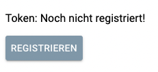
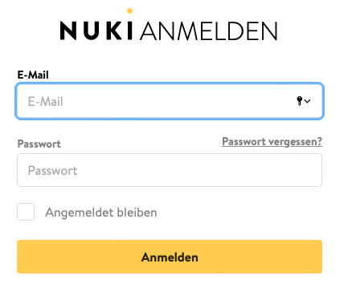
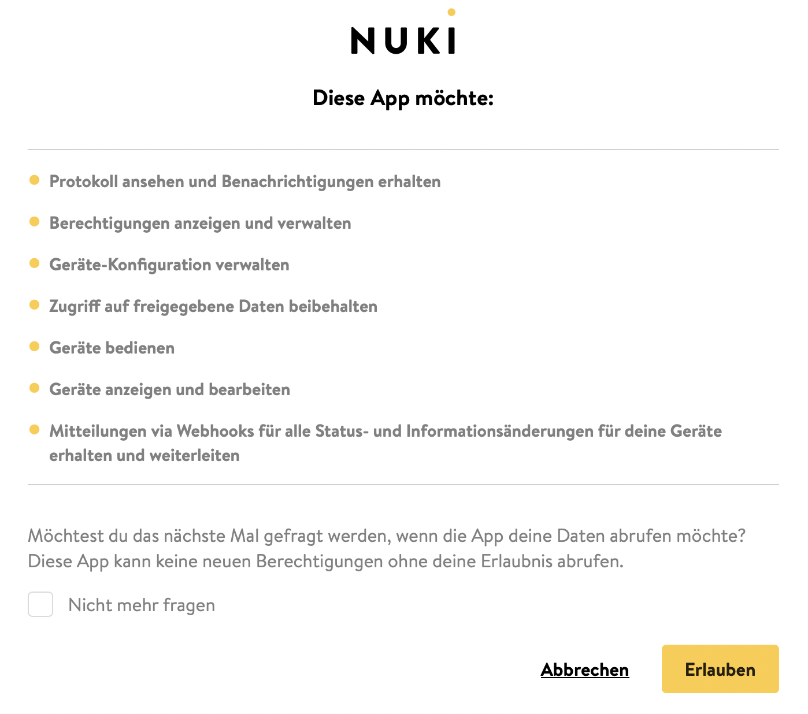
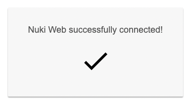

# Nuki Splitter Web API  

[](https://nuki.io/de/)

Dieses Modul stellt die Kommunikation mit der [Nuki Web API](https://developer.nuki.io/t/nuki-web-api/25) her.

Für dieses Modul besteht kein Anspruch auf Fehlerfreiheit, Weiterentwicklung, sonstige Unterstützung oder Support.  
Bevor das Modul installiert wird, sollte unbedingt ein Backup von IP-Symcon durchgeführt werden.  
Der Entwickler haftet nicht für eventuell auftretende Datenverluste oder sonstige Schäden.  
Der Nutzer stimmt den o.a. Bedingungen, sowie den Lizenzbedingungen ausdrücklich zu.  

### Inhaltsverzeichnis

1. [Funktionsumfang](#1-funktionsumfang)
2. [Voraussetzungen](#2-voraussetzungen)
3. [Software-Installation](#3-software-installation)
4. [Einrichten der Instanzen in IP-Symcon](#4-einrichten-der-instanzen-in-ip-symcon)
5. [Statusvariablen und Profile](#5-statusvariablen-und-profile)
6. [WebFront](#6-webfront)
7. [PHP-Befehlsreferenz](#7-php-befehlsreferenz)

### 1. Funktionsumfang

* Kommunikation mit der [Nuki Web API](https://developer.nuki.io/t/nuki-web-api/25)

### 2. Voraussetzungen

- IP-Symcon ab Version 6.0
- Nuki Smartlock 1.0, 2.0, 3.0 (Pro)
- Nuki Opener
- [Nuki Web Aktivierung](https://web.nuki.io/#/login)

Drücken Sie in der Instanzkonfiguration auf die Schaltfläche `Registrieren`  

[]()  

Melden Sie sich bei Nuki Web an  

[]()  

Bestätigen Sie den Hinweis  

[]()  

Die Instanz wurde erfolgreich registriert  

[]()

### 3. Software-Installation

* Bei kommerzieller Nutzung (z.B. als Einrichter oder Integrator) wenden Sie sich bitte zunächst an den Autor.
* Über den Module Store das `Nuki Web`-Modul installieren.

### 4. Einrichten der Instanzen in IP-Symcon

- Unter `Instanz hinzufügen` kann das `Nuki Splitter Web API`-Modul mithilfe des Schnellfilters gefunden werden.
- Weitere Informationen zum Hinzufügen von Instanzen in der [Dokumentation der Instanzen](https://www.symcon.de/service/dokumentation/konzepte/instanzen/#Instanz_hinzufügen)

__Konfigurationsseite__:

| Name                 | Beschreibung                                        |
|----------------------|-----------------------------------------------------|
| Aktiv                | Schaltet den Splitter in- bzw. aktiv                |
| Status aktualisieren | Aktualisiert automatisch die Statusdaten der Geräte |
| Timeout              | Netzwerk Timeout                                    |

### 5. Statusvariablen und Profile

Die Statusvariablen/Kategorien werden automatisch angelegt. Das Löschen einzelner kann zu Fehlfunktionen führen.

#### Statusvariablen

Es werden keine Statusvariablen verwendet.

#### Profile

Es werden keine Profile verwendet.

### 6. WebFront

Die Splitter Instanz hat im WebFront keine Funktionalität.

### 7. PHP-Befehlsreferenz

```text
Liste der Smart Locks (Geräte) abrufen

NUKISW_GetSmartLocks(integer $InstanzID);
Liefert als Rückgabewert einen json kodierten String mit Daten der vorhandenen Geräten.

Beispiel:

$devices = NUKISW_GetSmartLocks(12345);
print_r(json_decode($devices, true));  //Ausgabe der Daten als Array
```

```text
Informationen eines bestimmten Smart Locks (Gerät) abrufen

NUKISW_GetSmartLock(integer $InstanzID, string $SmartLockID);
Liefert als Rückgabewert einen json kodierten String mit Daten des Gerätes.

Beispiel:

$devices = NUKISW_GetSmartLocks(12345, '9876543210');
print_r(json_decode($devices, true));  //Ausgabe der Daten als Array
```

```text
Aktualisiert eine Smart Lock (Geräte) Konfiguration.

NUKISW_UpdateSmartLockConfig(integer $InstanzID, string $SmartLockID, string $Konfiguration);
Liefert als Rückgabewert einen json kodierten String mit dem HTTP Code.

$config = '{
            "name": "string",
            "latitude": 0,
            "longitude": 0,
            "capabilities": 0,
            "autoUnlatch": true,
            "liftUpHandle": true,
            "pairingEnabled": true,
            "buttonEnabled": true,
            "ledEnabled": true,
            "ledBrightness": 0,
            "timezoneOffset": 0,
            "daylightSavingMode": 0,
            "fobPaired": true,
            "fobAction1": 0,
            "fobAction2": 0,
            "fobAction3": 0,
            "singleLock": true,
            "operatingMode": 0,
            "advertisingMode": 0,
            "keypadPaired": true,
            "homekitState": 0,
            "timezoneId": 0,
            "deviceType": 0,
            "wifiEnabled": true,
            "operationId": "string"
           }';

Beispiel:

$updateConfig = NUKISW_UpdateSmartLockConfig(12345, '987654321', $config);
```

```text
Aktualisiert die erweiterte Konfiguration eines Nuki Openers

NUKISW_UpdateOpenerAdvancedConfig(integer $InstanzID, string $SmartLockID, string $ErweiterteKonfiguration);
Liefert als Rückgabewert einen json kodierten String mit dem HTTP Code.

Beispiel:

$advancedConfig = '{
                    "intercomId":0,
                    "busModeSwitch":0,
                    "shortCircuitDuration":0,
                    "electricStrikeDelay":0,
                    "randomElectricStrikeDelay":false,
                    "electricStrikeDuration":3000,
                    "disableRtoAfterRing":true,
                    "rtoTimeout":20,
                    "doorbellSuppression":0,
                    "doorbellSuppressionDuration":500,
                    "soundRing":0,
                    "soundOpen":0,
                    "soundRto":0,
                    "soundCm":0,
                    "soundConfirmation":1,
                    "soundLevel":0,
                    "singleButtonPressAction":1,
                    "doubleButtonPressAction":4,
                    "batteryType":0,
                    "automaticBatteryTypeDetection":false,
                    "autoUpdateEnabled":true
                   }';
           
$updateAdvancedConfig = NUKISW_UpdateOpenerAdvancedConfig(12345, '987654321', $advancedConfig);
```

```text
Sperren und Entsperren eines Smart Locks (Gerätes) mit Optionen

NUKISW_SetSmartLockAction(integer $InstanzID, string $SmartLockID, int $Aktion, int $Option);
Liefert als Rückgabewert einen json kodierten String mit dem HTTP Code.

$Aktion:
Nuki Smart Lock:    1 unlock
                    2 lock
                    3 unlatch
                    4 lock 'n' go
                    5 lock 'n' go with unlatch
Nuki Box:           1 unlock
Nuki Opener:        1 activate ring to open
                    2 deactivate ring to open
                    3 open (electric strike actuation)
                    6 activate continuous mode
                    7 deactivate continuous mode
                    
$Option:            0 none
                    2 force
                    4 full lock
                    
Beispiel:

$action = NUKISW_SetSmartLockAction(12345, '987654321', 3, 0);
```

```text
Eine Protokoll-Liste von einem Smart Lock (Gerät) erhalten

NUKISW_GetSmartLockLog(integer $InstanzID, string $SmartLockID, string $Parameter);
Liefert als Rückgabewert einen json kodierten String mit den Daten.

$Parameter = 'fromDate=' . $datetime . '&limit=' . $limit;

Beispiel:

$log = NUKISW_GetSmartLockLog(12345, '987654321', $Parameter);
print_r(json_decode($log, true));  //Ausgabe der Daten als Array
```